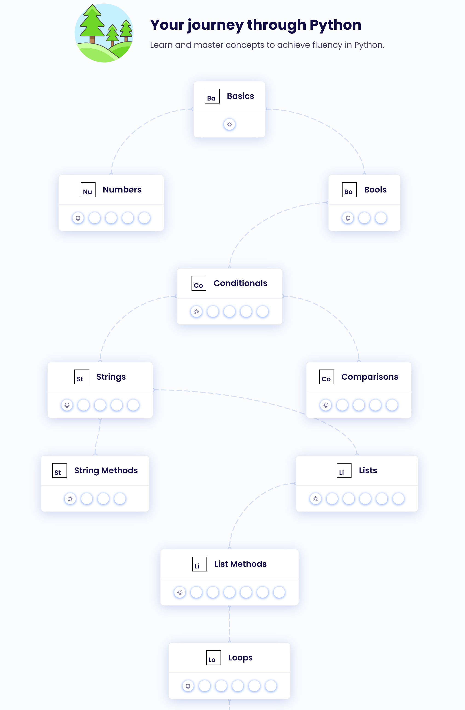

# GitHub and Python Foundations Assignment

## Overview
This assignment will help you practice:
1. Using GitHub for version control
2. Writing a simple Python script
3. Working with command line arguments
4. Implementing basic file I/O operations
5. Using the hashlib library for cryptographic hashing

## Setup (Not Required for Submission)
- Install the necessary tools from the Quickstart section:
    - (Recommended) Package manager
        - MacOS: [Homebrew](https://brew.sh)
        - Windows: WSL - use apt
    - Python 3
    - VS Code

## GitHub Student Account Setup
1. Sign up for a GitHub account if you haven't already at [github.com](https://github.com)
2. Apply for GitHub Student Developer Pack benefits:
   - Visit [education.github.com/pack](https://education.github.com/pack)
   - Click "Get your pack"
   - Verify your student status using your school email
   - Benefits include:
     - Unlimited private repositories
     - GitHub Copilot access
     - Extra free Codespaces compute hours
     - Various developer tools and services

## Git Basics
- Complete the [GitHub Foundations](https://learn.microsoft.com/en-us/training/paths/github-foundations/) tutorial (focus on the first 3 modules)
- Microsoft also has a guide on [Getting started with GitHub and Visual Studio Code](https://learn.microsoft.com/en-us/training/paths/get-started-github-and-visual-studio-code/)

## Python Foundations (Recommended)
- Create an account on [Exercism](http://exercism.org/tracks/python) 
- Work through the [Python track](http://exercism.org/tracks/python) until you get to loops
- Complete the _Making the Grade_ exercise, which you will submit via GitHub
    
    

## Assignment Instructions

### GitHub Classroom Assignment
- This repository was created when you accepted the GitHub Classroom assignment
- It includes starter code and automated tests that will run when you push your changes
- Clone the repository to your local machine to begin working on the assignment

### Part 1: Update this README.md
Replace the "Part 1" section with:
- A brief introduction about yourself (first name only)
- What you're hoping to get out of this course
- A musical recommendation and a link to something about it (song, album, artist)

### Part 2: Complete the email_hasher.py Script
The email_hasher.py script should:
1. Accept an email address as a command line argument
2. Hash the email using the SHA-256 algorithm from the hashlib library
3. Write the hash in hexadecimal format to a file named 'hash.email'

Example usage:
```
python email_hasher.py "example@email.com"
```

After running this command, a file named 'hash.email' should be created containing the SHA-256 hash of 'example@email.com' in hexadecimal format.

Your script must pass the automated tests:
- It should handle command line arguments correctly
- It should use the SHA-256 algorithm specifically
- It should output the hash in hexadecimal format
- It should create a file named 'hash.email' with the hash as content

### Example Solution Structure
```python
# email_hasher.py
import sys
import hashlib

def hash_email(email):
    """
    Hash an email address using SHA-256 and return the hexadecimal digest.
    
    Args:
        email (str): The email address to hash
        
    Returns:
        str: The SHA-256 hash of the email in hexadecimal format
    """
    # Your implementation here
    pass

def main():
    # Your implementation here
    pass

if __name__ == "__main__":
    main()
```

## Submission
Commit and push your changes to this repository. The auto-grading workflow will run tests to verify your implementation.

### Auto-Grading
- When you push your changes, GitHub Actions will automatically run the tests
- You can see the test results in the "Actions" tab of your repository
- If all tests pass, you'll see a green checkmark
- If any tests fail, you'll see a red X and can click to see details about what failed

## Grading
Your submission will be graded based on:
1. Correct implementation of the email_hasher.py script
2. Proper handling of command line arguments
3. Correct use of the SHA-256 algorithm
4. Proper file output
5. Completion of the README.md with the required information

## Optional Additional Practice
- Work on the [Whirlwind Tour of Python](https://jakevdp.github.io/WhirlwindTourOfPython/) chapters (through ch7, "Control Flow Statements") alongside the notebooks [on GitHub](https://github.com/jakevdp/WhirlwindTourOfPython)
    1. Work through examples in your own development branch
    2. Commit your changes when you've reached good stopping points
    3. When you're ready for feedback, share it with someone else
    4. Try more [exercises on python basics](https://pythonbasics.org/exercises/) or search the web for exercises/examples specific to what you want to practice. [Python is the second-most popular programming language](https://octoverse.github.com/2022/top-programming-languages) (javascript runs the web at \#1), so there's a lot of material out there.
